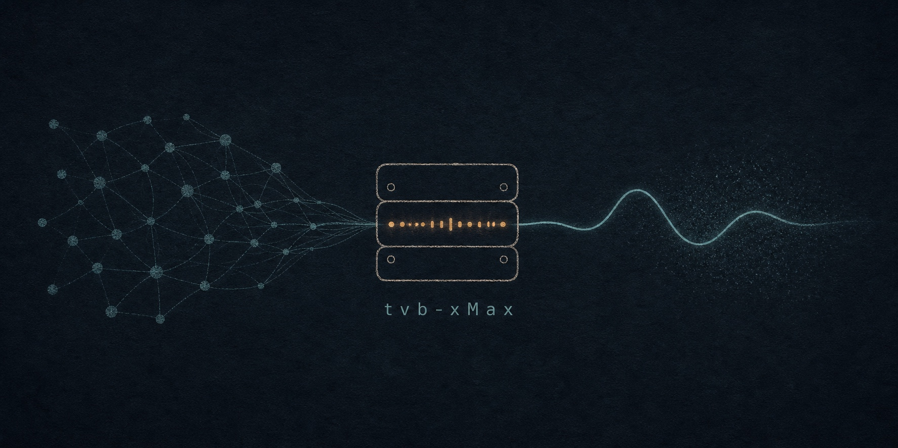
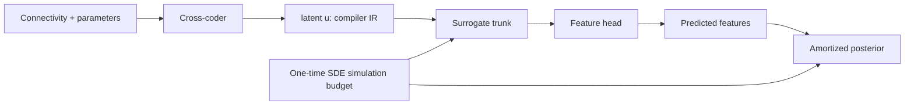
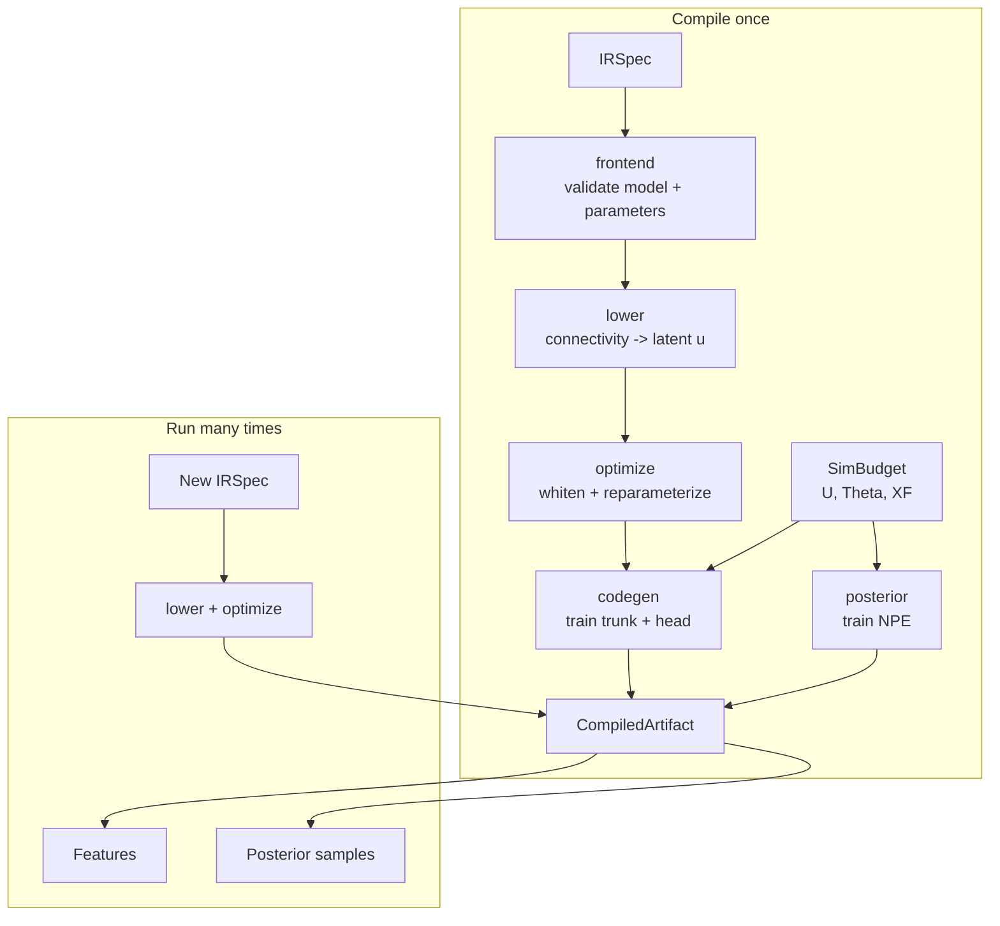

# tvb-xMax

<p align="center">
  
</p>

> **Compile a virtual-brain simulation budget once. Run surrogate inference thereafter.**

[](pyproject.toml)
[](https://github.com/jax-ml/jax)
[](tests)
[](LICENSE)

`tvb-xMax` is a rigorous parody of an "advanced AI math compiler" for virtual-brain simulation. Under the parody is a practical system: it learns a neural surrogate from a one-time simulation budget, treats a parcellation-invariant cross-coder latent as its intermediate representation, and replaces repeated SDE evaluations with batched JAX forward passes.

The compiler does **not** make scientific validation free. It makes the repeated evaluation of a validated, trained surrogate cheap.

<p align="center">
  <a href="#quick-start">Quick start</a> ·
  <a href="#measured-performance">Measured performance</a> ·
  <a href="#how-it-works">How it works</a> ·
  <a href="#the-four-swaps">Swaps</a> ·
  <a href="PLAN.md">Roadmap</a>
</p>

---

## Why this exists

Simulation-based inference has an expensive inner loop:

```text
sample parameters -> integrate SDE -> extract features -> train/sample posterior
```

That is the right computation when building a simulator-backed training budget. It is wasteful when repeated unchanged for every subject, parameter proposal, feature query, or compatible parcellation.

`tvb-xMax` compiles that budget into an artifact:



At runtime, no SDE is integrated. The fast path is:

```text
IRSpec -> lower -> optimize -> surrogate(u, theta) -> optional posterior samples
```

## Measured performance

The current benchmark is deliberately explicit about its setup:

- Hopf oscillator SDE implemented with `vbjax.make_sde`
- 76 regions
- temporal-variance features
- 2-layer, width-128 tanh trunk + linear feature head
- CPU timing, with synchronized JAX execution on both paths
- synthetic cross-coder and synthetic training budget: this is a throughput benchmark, **not** a biological-fidelity result

| Integration steps | Workload | SDE time | Surrogate time | Measured speedup |
|---:|---|---:|---:|---:|
| 1,000 | One feature evaluation | 5.994 ms | 0.048 ms | 125.9x |
| 5,000 | One feature evaluation | 20.684 ms | 0.078 ms | 266.1x |
| 10,000 | One feature evaluation | 20.664 ms | 0.060 ms | **343.2x** |
| 5,000 | Batch of 4,096 | 74.158 s | 44.446 ms | 1,668.5x |
| 10,000 | Batch of 4,096 | 98.915 s | 45.287 ms | **2,184.2x** |

The direct single-call headline is **about 300x** for a 10,000-step SDE: the latest run measured 20.664 ms for one simulation versus 0.060 ms for one warmed, compiled surrogate forward pass. A 4,096-simulation budget for the same workload took 84.6 seconds; the compiled forward path yields an estimated **1.41 million x amortized throughput advantage** when comparing a fresh budget with one already-compiled forward pass.

Read the full reproducible output in [`bench/results.md`](bench/results.md) or rerun it:

```bash
python bench/bench_hopf_speedup.py
```

> Performance varies with integration length, parcellation size, hardware, batching, and simulator implementation. Treat the table as a benchmark configuration, not a universal claim.

## How it works



| Compiler stage | Contract | Implementation |
|---|---|---|
| `frontend` | Validate model, target, and parameter ranges | [`compiler/frontend.py`](tvb_xmax/compiler/frontend.py) |
| `lower` | Encode a raw connectome or accept a precomputed latent | [`compiler/lower.py`](tvb_xmax/compiler/lower.py) |
| `optimize` | Condition the latent against a cohort MVN | [`compiler/optimize.py`](tvb_xmax/compiler/optimize.py) |
| `codegen` | Train `S(u, theta) -> xf` | [`compiler/codegen.py`](tvb_xmax/compiler/codegen.py) |
| `vectorize` | Batch and shard surrogate/posterior evaluation | [`compiler/vectorize.py`](tvb_xmax/compiler/vectorize.py) |
| `posterior` | Attach amortized neural posterior estimation | [`compiler/posterior.py`](tvb_xmax/compiler/posterior.py) |
| `artifact cache` | Persist and reuse compiled artifacts | [`compiler/artifact_cache.py`](tvb_xmax/compiler/artifact_cache.py) |

### The IR

The intermediate representation is the pair:

```text
(u, theta)

u     = parcellation-invariant cross-coder latent
theta = normalized model parameters in [0, 1]^d
```

The raw connectome is only needed before lowering. Everything downstream operates on JAX arrays in IR space.

## The four swaps

| Swap | What changes | Runtime cost | Artifact behavior |
|---|---|---:|---|
| **Parcellation** | Connectivity matrix / view | One encode | Reuse the same artifact |
| **Parameters** | `theta` | Forward-pass input change | Reuse the same artifact |
| **Model** | Dynamics family | Cache lookup or compile | Resolve through `ArtifactCache` |
| **Features** | `var`, `fc`, `bold`, custom head | Cache lookup or head compile | Shared trunk is reusable |

The surrogate has a shared trunk and feature-specific linear head, so feature work can preserve the learned representation instead of retraining the full network.

## Quick start

Install the compiler and optional SBI tooling:

```bash
pip install -e ".[sbi,dev]"
```

Or install dependencies directly:

```bash
pip install jax jaxlib numpy optax vbjax sbi torch fastapi uvicorn pydantic
```

Run the examples:

```bash
python examples/01_compile_and_infer.py  # compile + fast-path inference
python examples/02_swaps.py              # parcellation / parameter / model / feature swaps
python examples/03_gpu_batch.py          # batched GPU evaluation
python bench/bench_hopf_speedup.py        # real Hopf SDE throughput benchmark
```

Run tests:

```bash
pytest tests/
```

Run coverage explicitly when the JAX runtime has sufficient device memory:

```bash
pytest --cov=tvb_xmax.compiler --cov=tvb_xmax.ir \
  --cov-report=term-missing --cov-fail-under=80
```

## Library use

```python
import jax.numpy as jnp

from tvb_xmax import IRSpec, SimBudget
from tvb_xmax.compiler import ArtifactCache, pipeline, swap

# A real budget comes from your simulator, or:
# from tvb_xmax.compiler.sim_budget import from_apvbt
budget = SimBudget(U=U, Theta=Theta, XF=XF, model="hopf", feature="var", nlat=16)
budget.validate()

spec = IRSpec(
    model="hopf",
    connectivity=jnp.zeros(16),
    connectivity_is_latent=True,
    parameters={"k": 0.15, "D": 0.4},
    target="features",
)

# Spend the simulation budget once.
report = pipeline.compile_spec(
    spec, crosscoder, budget, d_feat=XF.shape[-1], train_posterior=False
)
artifact = report.artifact

# Fast path: lower -> optimize -> surrogate forward pass; no SDE.
out = pipeline.run(artifact, spec, crosscoder)

# Parameter swap: same compiled artifact.
faster_coupling = swap.swap_parameters(spec, k=0.25, D=0.1)
out = pipeline.run(artifact, faster_coupling, crosscoder)

# Model / feature swap: resolve a cached artifact or compile it once.
cache = ArtifactCache("artifacts")
out = pipeline.run_cached(
    spec, crosscoder, cache, budget, d_feat=XF.shape[-1], train_posterior=False
)
```

## Reliability checks

The compiler records the artifacts and diagnostics needed to separate fast execution from trustworthy inference:

- surrogate MSE from the training budget
- real simulation-to-surrogate timing where a compatible SDE benchmark is available
- SBC-style rank calibration score
- C2ST posterior-versus-reference score
- artifact identity: `(model, feature, nlat)`
- serialization-safe trunk/head parameters and artifact cache persistence

The details are deliberate: `lower()` applies the trained encoder to the supplied subject matrix, not the cross-coder cohort mean; the surrogate uses `optax.adam`; and the test suite covers compile, cache, swap, vectorization, posterior, and extracted simulation paths.

## Models

Six parameter-space targets are available today:

| Model | Parameters |
|---|---|
| Hopf | `k`, `D`, `eta`, `omega` |
| MPR | `k`, `D`, `J`, `w` |
| Wilson-Cowan | `k`, `D`, `tau_e`, `tau_i` |
| Wong-Wang | `k`, `D`, `w`, `I0` |
| Kuramoto | `k`, `D`, `omega` |
| FitzHugh-Nagumo | `k`, `D`, `a`, `b` |

Add another target by implementing a `SurrogateTarget` and registering its parameter space. See [`AGENTS.md`](AGENTS.md).

## Architecture and provenance

`tvb-xMax` depends on:

- [`vbjax`](https://github.com/ins-amu/vbjax) for JAX-oriented connectome and SDE primitives
- [`sbi`](https://github.com/mackelab/sbi) for optional neural posterior estimation
- extracted, minimal apvbt-compatible utilities under [`tvb_xmax/_apvbt`](tvb_xmax/_apvbt) for cross-coder and simulation-budget interoperability

The project uses `vbjax` and simulation code at compile time; it uses the compiled surrogate at inference time.

## API and community

- **API**: `tvbxmax serve` exposes FastAPI endpoints for accounts, compile jobs, inference, swaps, and the leaderboard.
- **Agents**: `tvbxmax agents` runs model-specific OpenClaw-style hyperparameter search agents.
- **Leaderboard**: artifacts are ranked by calibration, fidelity, and measured speedup.

See [`PLAN.md`](PLAN.md) for the full architecture, evidence, and roadmap. See [`AGENTS.md`](AGENTS.md) for development conventions and troubleshooting.

## License

MIT. `vbjax`, `sbi`, and extracted apvbt-compatible code retain their respective upstream licenses.
